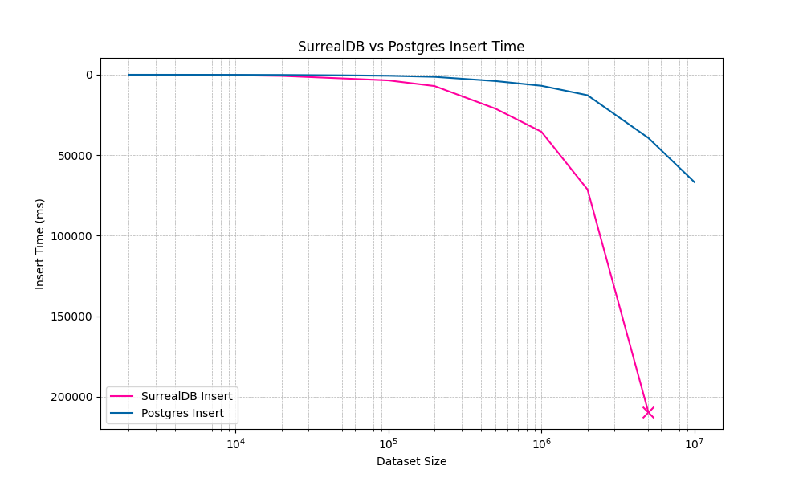
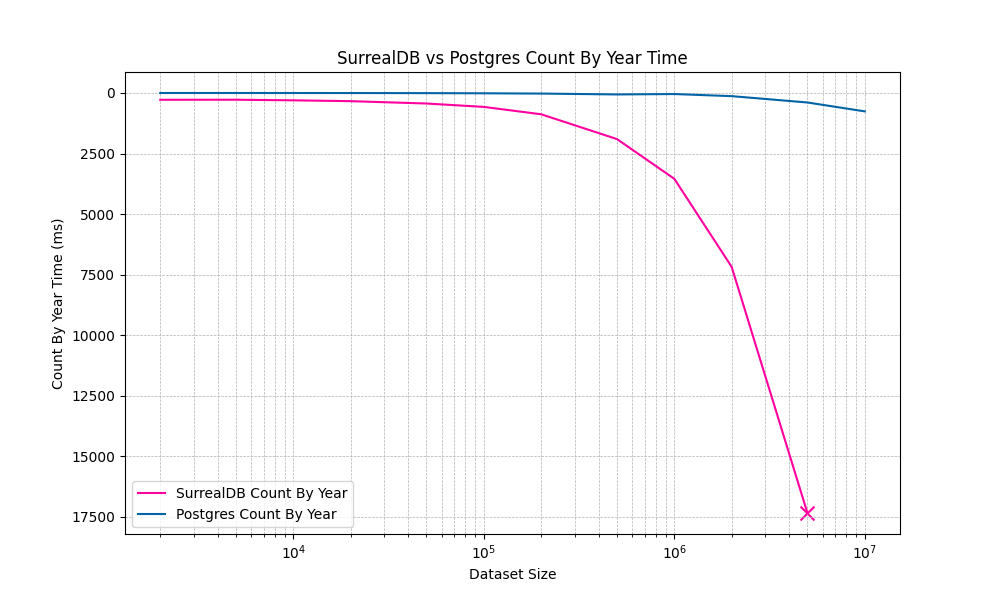

# SurrealDB benchmark

Test how SurrealDB performs on a large dataset from [IMDb](https://developer.imdb.com/non-commercial-datasets/).

## How to run

Dependencies: `docker`, `bun`, `wget`, `ls`, `wc`.

```bash
make
docker-compose up -d
bun install
bun run packages/postgres/postgres.ts
bun run packages/surrealdb/surrealdb.ts
```

## My results

### SurrealDB

**☠️ Did not finish** - container crashed.

|     | Dataset Size | Inserted items | Insert (ms) | Query 50 (ms) | Query By ID (ms) | Count By Year (ms) |
| --- | -----------: | -------------: | ----------: | ------------: | ---------------: | -----------------: |
| 0   |         2000 |           1000 |      504.14 |          3.67 |             0.75 |             280.49 |
| 1   |         5000 |           3000 |      224.52 |          2.20 |             0.39 |             278.19 |
| 2   |        10000 |           5000 |      356.75 |          2.82 |             0.37 |             302.93 |
| 3   |        20000 |          10000 |      746.56 |          3.51 |             0.63 |             337.72 |
| 4   |        50000 |          30000 |     2319.39 |          2.17 |             0.51 |             435.01 |
| 5   |       100000 |          50000 |     3554.34 |          2.08 |             0.37 |             574.70 |
| 6   |       200000 |         100000 |     7057.87 |          2.00 |             0.33 |             879.49 |
| 7   |       500000 |         300000 |    21089.96 |          2.50 |             0.55 |            1903.85 |
| 8   |      1000000 |         500000 |    35476.60 |          3.24 |             0.52 |            3543.67 |
| 9   |      2000000 |        1000000 |    71344.25 |          1.41 |             0.31 |            7180.26 |
| 10  |      5000000 |        3000000 |   209603.93 |          2.21 |             0.55 |           17349.68 |
| 11  |     10000000 |        5000000 |       D.N.F |         D.N.F |            D.N.F |              D.N.F |
| 12  |     11042233 |        1042233 |       D.N.F |         D.N.F |            D.N.F |              D.N.F |

### Postgres

|     | Dataset Size | Inserted items | Insert (ms) | Query 50 (ms) | Query By ID (ms) | Count By Year (ms) |
| --- | -----------: | -------------: | ----------: | ------------: | ---------------: | -----------------: |
| 0   |         2000 |           1000 |       31.67 |          0.91 |             0.56 |               0.47 |
| 1   |         5000 |           3000 |       47.98 |          0.46 |             0.23 |               0.73 |
| 2   |        10000 |           5000 |       78.77 |          0.52 |             0.23 |               1.37 |
| 3   |        20000 |          10000 |      144.77 |          0.89 |             0.27 |               2.40 |
| 4   |        50000 |          30000 |      397.94 |          0.44 |             0.21 |               6.04 |
| 5   |       100000 |          50000 |      675.20 |          0.45 |             0.22 |              12.57 |
| 6   |       200000 |         100000 |     1345.34 |          0.58 |             0.22 |              23.88 |
| 7   |       500000 |         300000 |     3961.04 |          0.35 |             0.14 |              59.87 |
| 8   |      1000000 |         500000 |     6888.47 |          0.44 |             0.25 |              43.52 |
| 9   |      2000000 |        1000000 |    12775.88 |          0.45 |             0.16 |             130.27 |
| 10  |      5000000 |        3000000 |    39303.37 |          0.40 |             0.13 |             392.44 |
| 11  |     10000000 |        5000000 |    66739.28 |          0.51 |             0.19 |             759.63 |
| 12  |     11042233 |        1042233 |    16481.19 |          0.70 |             0.25 |             700.22 |

### Charts




## Conclusion

I intended to run a more complex test with joins and aggregations, but SurrealDB was not able to handle the dataset size. SurrealDB multi-modal approach to data modelling, different from SQL, is very appealing. I will not be using it as a main database. It could maybe work well as a small embedded database, but for my use case it lacks built-in conflict resolution needed for offline first applications. I'm curious to see how SurrealDB will evolve in the future. If you find my testing inaccurate or outdated, please raise an issue or a PR. Contributions are welcome.
